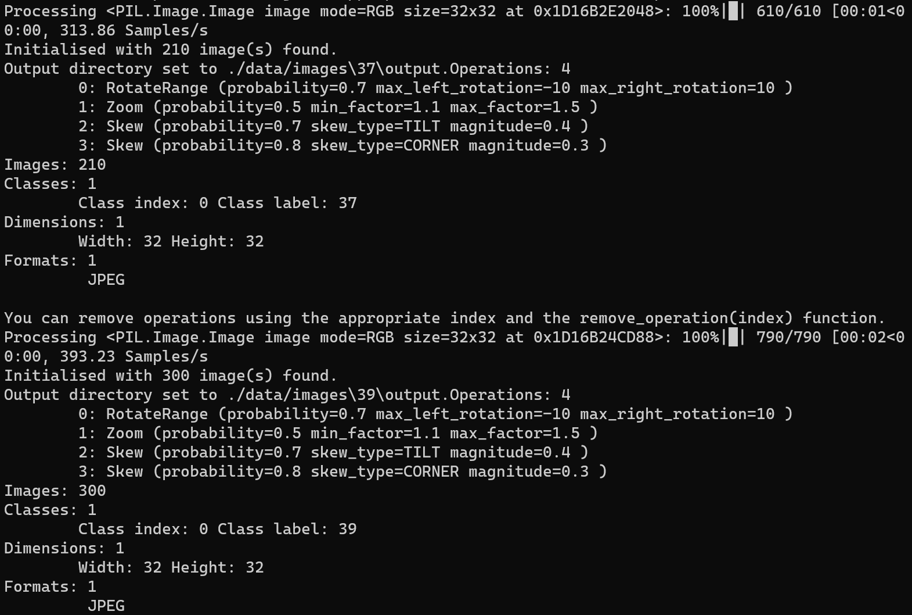
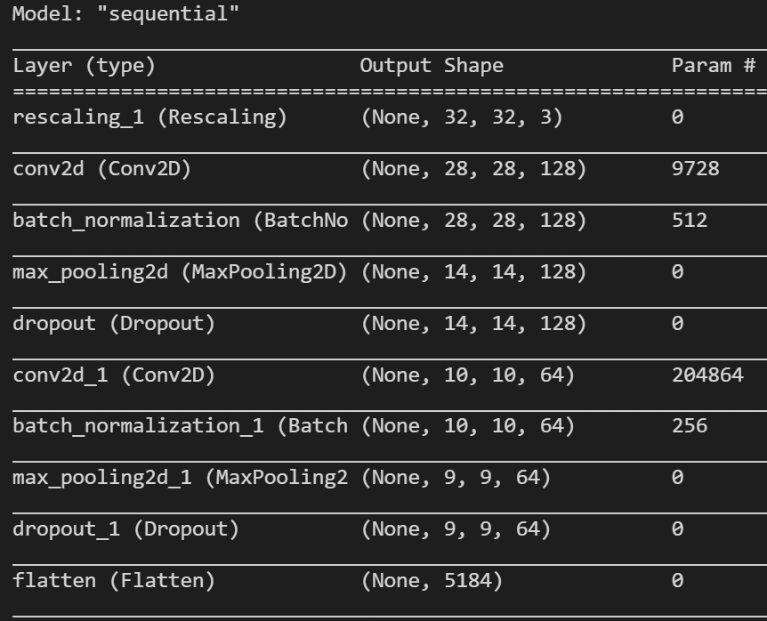

# **Traffic Sign Recognition**

---

**Build a Traffic Sign Recognition Project**

Overview
---
In this project, I use deep neural networks and convolutional neural networks to classify traffic signs. A model is trained and validated so it can classify traffic sign images using the [German Traffic Sign Dataset](http://benchmark.ini.rub.de/?section=gtsrb&subsection=dataset). Then, the trained model is used to try predicting on images of German traffic signs downloaded from the web.

The goals / steps of this project are the following:
* Load the data set (see below for links to the project data set)
* Explore, summarize, and visualize the dataset
* Design, train and test a model architecture
* Use the model to make predictions on new images
* Analyze the softmax probabilities of the new images
* Summarize the results with a written report


[//]: # (Image References)

[image1]: ./images/distrib.jpg "Distribution"
[image9]: ./images/summary.jpg "Dataset View"
[image2]: ./images/data-centric.png "Data-centric"
[image3]: ./images/visibility.png "Visibility"
[image44]: ./ímages/img-aug.png "Augmentation"
[image5]: ./images/augmented.png "Augmented"
[image6]: ./images/model-summary.png "Model Summary"
[image7]: ./images/img-new.png "New Images"


---
### Writeup / README

#### This project was executed using a notebook that can be seen [here](https://github.com/zenetio/Traffic-Car-Classifier/blob/master/Traffic_Sign_Classifier.ipynb), including the project code.

### 1. Data Set Summary & Exploration

#### Basic summary of the data set.

Using `pandas, numpy` and `python`, we can provide a summary about the dataset.
The image below is a view of the dataset images. Note that some images are dark and difficult to identify the image sign, which will penalise the model performance. To avoid this problem, I used an algorithm to increase the brightness and help the image visualization. I discuss this approach with more details ahead.

![alt text][image9] Figure 1 - Dataset View.

The data analysis code performed the following summary statistics of the traffic
signs data set:

* The size of training set is 34799
* The size of the validation set is 4410
* The size of test set is 12630
* The shape of a traffic sign image is (32,32)
* The number of unique classes/labels in the data set is 43

#### 1.1. Exploratory visualization of the dataset.

Using the code below with `seaborn` library, it is possible to visualize the class distribution in the dataset

```py
import seaborn as sns
def plot_distribution(y):
    fig, ax = plt.subplots(figsize=(8,8))
    sns.countplot(y)
    ax.set_title('Distribution of Traffic Signs', fontsize=14)
    ax.set_xlabel('Signs', fontsize=12)
    ax.set_ylabel('Count', fontsize=14)
    plt.show()
plot_distribution(y_train)
```

Here is an exploratory visualization of the data set. It is a bar chart showing the class distribution is imbalance.

![alt text][image1]<br>
Figure 2 - Dataset Distribution.

The notebook shows that I did two tries: the first using class imbalance and the second using class balanced. You can check the results at the end of this writeup.

### 2. Preprocessing the image data.

**First Solution:**<br>
In my first solution, I used the following dataset preprocessing:

- No class balance
- RGB image
- Shuffle
- Normalization

The idea of using this approach was to get insights of model performance and how far (or not) it could be from the target value.
Using this approach, the model prediction for validation accuracy was `73,61`% that is far from the target of `93`%

**Second Solution:**<br>
In my second solution, I decided to use a much more agressive approach to reach the target.
In [this](https://youtu.be/06-AZXmwHjo) nice presentation from Dr. Andrew Ng, he says that "data is food for AI", and says that how `Data-centric` approach, in general, provides better model performance than `Model-centric` approach.

We can see in the figure below that in Data-centric approach we can use tools to improve the data quality, which may allow multiple models to do well.

![alt text][image2]
Figure 3 - Data-centric. Author: [Andrew Ng Presentation](https://youtu.be/06-AZXmwHjo)

So, that is what I did in this solution.

### Visualization

Take a look the left side of image below. It shows some original images of class `60 Km/h`. Note how difficult is to read the velocity value. I would say that, from 24 images, only images 04, 09, 10, 12, 14, and 18 have reasonable visibility to know the velocity value, which means that we are 18 images with bad visibility that will impact negatively the model performance. We are talking that only 25% are good for use! And the bad news is that this bad visualization can be seen in the entire dataset. Well, we can not get high predictions using the dataset as is.

![alt text][image3] Figure 4 - Visibility.

So, for data preprocessing, I decided to improve the image visualization before any other image task, because if I had no success, any other additional preprocessing task could not improve the model prediction significantly.

In this case, I could use some solutions like:

- Just delete the images with bad visualization
- Delete images and collect more images with good visualization
- Use a tool to improve the image visibility

The first option is not good as I showed, with a simple sample, that we have around only 25% of well visible images.
The second option is not fiseable because it would take a extremely long time to replace the bad images.
So, use a tool to improve visibility seems to be the better option here.
Then, I decided to apply an algorithm named [Contrast Limited Adaptive Histogram Equalization](https://en.wikipedia.org/wiki/Adaptive_histogram_equalization), implemented in scikit-image library. The algorithm can improve the contrast of traffic sign images dataset, which will help the deep learning model identify the traffic signs. 

```python
image = exposure.equalize_adapthist(image, clip_limit=0.1)
```

Using the snippet code above, it was possible to filter the entire dataset image.

The option showed to be excelent, as you can see in the final result in the rigth side of image above. Note that from the 24 images, only 00, 05, and 06 are difficult to read, which means that we moved from 25% to 87.5% or an improvement of 62.5% in our dataset!

The result shows the visibility is much better and we are confident that this improvement can affect positively in the model performance.

### Class imbalance

Now, that we have images with better visibility, we can manage the high class imbalance mentioned in the beginning of this writeup.

To fix the class imbalance, I decided to create synthetic images using augmentation.<br>
For this task I used the [Augmentor](https://academic.oup.com/bioinformatics/article-abstract/35/21/4522/5466454?redirectedFrom=fulltext) tool, where I could create an equal number of images to all classes, removing the class imbalance. Below is the python snippet code I used to create synthetic data.

```python
p = Augmentor.Pipeline(img_path)
    # operations
    p.rotate(probability=0.7, max_left_rotation=10, max_right_rotation=10)
    p.zoom(probability=0.5, min_factor=1.1, max_factor=1.5)
    p.skew_tilt(.7, .4)
    p.skew_corner(.8, .3)
    p.status()
    p.sample(n_images - v)
    # copy images to label directory
    source_dir = os.path.join(img_path, "output")
    file_names = os.listdir(source_dir)
    for file_name in file_names:
        shutil.move(os.path.join(source_dir, file_name), img_path)
```

I decided to have a total of `4500` images per class which means that, for instance, for class 4 (70km/h) with 1980 original samples, the augmentation task created additional 2520 new synthetic images. The image below shows the `Augmentor` tool in action.

<br>
Figure 5 - Augmentor Operation

You can see the augmentation result in the image below.<br>
The left side shows some original images and the right side shows the same images after augmentation.

![alt text][image5]
Figure 6 - Some augmented images.

After create the synthetic data, I organized the new dataset on disk, creating a directory for each class, which allowed the use of `tensorflow.keras.preprocessing.image_dataset_from_disk` function to load the images to memory. During the image loading, we can provide some option to the keras method like image size, batch size and other parameters used by the model.

### Normalization

As the next step, I decided to normalize the dataset.

The original images are in RGB color and I decided to try train using color images, where channel values are in the `[0, 255]` range. This is not ideal for a neural network; in general, you should seek to make your input values small. Here, we will standardize values to be in the `[0, 1]` by using a Rescaling layer.

```py
from tensorflow.keras import layers
normalization_layer = tf.keras.layers.experimental.preprocessing.Rescaling(1./255)
```

The snippet code above shows how to call the Rescaling layer. In this case, we can pass the entire dataset over the `normalization_layer` function or add this layer to the model architecture that will take care of the rescaling process. I decided to use the second option.

To accelerate the model training, avoid lots of disk access, and try to avoid memory issues due to dataset size, I also added a dataset cache configuration.

### 3. Model Architecture

As a data-centric solution, the changes in the model architecture were minimum, when compared with the original LeNet-5 architecture.<br>
The Figure 6 shows the final model configuration with all layers and the sizes used on each layer.

<div style="text-align:center">
    <br>
Figure 6 - Model Summary
</div>

### 4. Train the Model

When training a model we need configure a set of hyperparameters. I used the following configuration:

```py
EPOCHS=500
batch_size = 64
img_height = 32
img_width = 32
l_rate = 0.001
optimizer = tf.keras.optimizers.Adam(learning_rate=l_rate)
loss_object = tf.keras.losses.SparseCategoricalCrossentropy()
checkpoint_path = "./checkpoint/training_15/weights.{epoch:02d}-{val_accuracy:.4f}.hdf5"
cp_callback = tf.keras.callbacks.ModelCheckpoint(
    filepath=checkpoint_path,
    save_weights_only=True,
    monitor='val_accuracy',
    mode='max',
    save_best_only=True,
    verbose=2)
reduce_lr_cb = tf.keras.callbacks.ReduceLROnPlateau(monitor='val_accuracy', factor=0.1,
    patience=10, min_lr=1E-7, verbose=2)
es_cb = tf.keras.callbacks.EarlyStopping(
    monitor='val_accuracy', min_delta=0, patience=22, verbose=2,
    mode='auto', baseline=None, restore_best_weights=True)
```

The training process uses a seriers of callbacks to automate the training. 

#### Epochs
The number of epochs is high, but this is not a problem as we are using Early Stop method.

#### Checkpoint
The `checkpoint` callback saves the model weights all the time that a new validation accuracy value is calculated. To facilitate the analysis, the saved model name has the current epoch number and the accuracy value. 

#### Reduce learning rate
The learning rate is reduced each 10 patience if the validation accuracy is not improved.

#### Early Stpping
The training process is stopped whether patience=22 and there is no improvement in the training. 

#### 4. Descrive the Solution

This is a very challenged project, due to the dataset quality.<br>
In the beginning, I discussed about the class imbalance and the dataset view quality. In the first solution, the result was far from the target of `0.93` and I think that it was because I did not consider these two points.<br>
So, for the second solution I decided to go for the data-centric direction as prpposed by [Dr. Adrew Ng](https://youtu.be/06-AZXmwHjo).<br>
Even so, I had to do many attempts until find the good combination of steps for dataset preprocessing. I did run many trainings changing:<br>
- batch size
- number of samples per class
- color mode (RGB or grayscale)
- diferent augment operations

At final, here the steps I used to get the successful solution:

1. Process the entire dataset with Contrast Limited Adaptive Histogram Equalization algorithm.
2. Use Augmentor tool to manage the class imbalance, creating a total of 4500 images per class
    - rotation
    - zoom
    - skew tilt
    - skew corner
3. Decided to use RGB mode

And the final result for this model training was:
* training set accuracy: 0.999
* validation set accuracy: 0.996
* test set accuracy: 0.98

The snippet code below shows the printed values after training process:
```py
print(f"Loss: {history7.history['loss'][74]:1.4f}, val_loss: {history7.history['val_loss'][74]:1.4f}, acc: {history7.history['accuracy'][74]*100:2.4f}, val_acc: {history7.history['val_accuracy'][74]*100:2.4f}")
Loss: 0.0002, val_loss: 0.0275, acc: 99.9961, val_acc: 99.5917
```

In the table below, we can see the results using the test dataset.

```
                                                   precision    recall  f1-score   support

                              Speed limit (20km/h)       1.00      1.00      1.00         6
                              Speed limit (30km/h)       0.97      1.00      0.99       103
                              Speed limit (50km/h)       1.00      0.97      0.98        99
                              Speed limit (60km/h)       0.98      0.95      0.97        65
                              Speed limit (70km/h)       0.99      0.99      0.99       103
                              Speed limit (80km/h)       0.99      1.00      1.00       119
                       End of speed limit (80km/h)       1.00      1.00      1.00        41
                             Speed limit (100km/h)       1.00      0.97      0.99        35
                             Speed limit (120km/h)       1.00      1.00      1.00        20
                                        No passing       1.00      1.00      1.00        68
      No passing for vehicles over 3.5 metric tons       0.98      0.94      0.96        68
             Right-of-way at the next intersection       1.00      1.00      1.00         8
                                     Priority road       0.99      1.00      1.00       107
                                             Yield       0.64      1.00      0.78         9
                                              Stop       0.84      1.00      0.91        16
                                       No vehicles       0.85      1.00      0.92        22
          Vehicles over 3.5 metric tons prohibited       0.93      1.00      0.96        25
                                          No entry       1.00      0.94      0.97        17
                                   General caution       0.96      1.00      0.98        71
                       Dangerous curve to the left       1.00      0.97      0.98        30
                      Dangerous curve to the right       0.89      1.00      0.94         8
                                      Double curve       0.96      0.92      0.94        26
                                        Bumpy road       0.94      0.76      0.84        21
                                     Slippery road       0.99      0.97      0.98        74
                         Road narrows on the right       0.92      0.77      0.84        31
                                         Road work       1.00      1.00      1.00        35
                                   Traffic signals       1.00      1.00      1.00        11
                                       Pedestrians       1.00      1.00      1.00        29
                                 Children crossing       1.00      1.00      1.00        20
                                 Bicycles crossing       1.00      0.99      0.99        78
                                Beware of ice/snow       1.00      0.88      0.94        25
                             Wild animals crossing       1.00      1.00      1.00        11
               End of all speed and passing limits       1.00      1.00      1.00       106
                                  Turn right ahead       1.00      1.00      1.00        20
                                   Turn left ahead       1.00      0.97      0.98        97
                                        Ahead only       0.80      1.00      0.89        16
                              Go straight or right       0.88      1.00      0.93         7
                               Go straight or left       0.85      0.85      0.85        13
                                        Keep right       0.96      0.98      0.97       108
                                         Keep left       0.96      0.93      0.94        27
                              Roundabout mandatory       0.94      0.99      0.96        83
                                 End of no passing       0.99      0.95      0.97        86
End of no passing by vehicles over 3.5 metric tons       1.00      0.99      0.99        84

                                          accuracy                           0.98      2048
                                         macro avg       0.96      0.97      0.96      2048
                                      weighted avg       0.98      0.98      0.98      2048
```
Note that the accuracy value with test set is a bit low compared with training accuracy, but this is considered normal as, in general, the model performance in production tends to be lower than in training value and, the big challenge in AI is to make this difference very low or, when possible, higher in production than in training.

As pointed above, I had to use an iterative process, until find the best solution to reach the target value. This iteration process was based on data-centric solution and so, the model architecture was not changed from one iteration to another.

Anyway, I just did a little change from the original model.
- *Added a new layer for image rescaling*. This is good because I dont need care about rescaling the images wheather I am training, evaluating, testing or if the model is in production.
- *Changed the number of filters from 32 to 128*. The idea was to increase the combinations of patterns to capture, as we have different classes where the patterns have little difference between them.
- *Changed the filter size from 3x3 to 5x5 and the number of filters from 32 to 128*. Increasing the size and number of filters, the model can collect a more global, high-level and representative information.
- *Added BatchNormalization to Conv layers*. In the same way we normalized the input data, we want to decrease the noise during propagation as well.
- *Added Dropout to Conv layers*. Added to avoid overfitting, but with low impact, as we are passing a low value (0.2).
- *Added softmax*. Finally, we are using softmax to provide the classification layer.

This model architecture cofiguration was not changed during the data-centric iterations.
 
### 5. Test the Model on New Images

#### 5.1. Performance over downloaded German traffic signs found on the web.

I downloaded some German traffic signs that I found on the web:

![alt text][image7]
Figure 7 - New Images
 
Based on the view quality, it seems that images: 3 (Priority road), 4 (Yeld), and 6 (50km/h), are the most difficult to predict, because the borders are not well defined and there is a background noise impacting the design of the sign.

#### 5.2. Predictions over the new traffic signs images

After run the model over the new images, the table below shows the results.

| Image			        |     Prediction	        					| 
|:---------------------:|:---------------------------------------------:| 
| Dangerous curve to the left | Dangerous curve to the left				| 
| No passing   			| No passing									|
| Priority road			| Priority road									|
| Yeld	      		| Yeld					 				|
| 30 km/h		| 30 km/h      							|
| 50 km/h		| 50 km/h      							|

The prediction is `100%` with accuracy new `100%`.

The table shows that the model was able to correctly guess all traffic signs, which gives an accuracy of 100%. This compares favorably to the accuracy on the test set of 98%.

The code for making predictions on my final model is located in the 22 and 27 cells at the end of the Ipython notebook.

For the first image, the model is sure that this is a **Dangerous curve to the left** sign (probability of 1.00), and the image does contain a Dangerous curve to the left sign. The top five soft max probabilities were

| Probability         	|     Prediction	        					| 
|:---------------------:|:---------------------------------------------:| 
| 1.00         			| Dangerous curve to the left 					| 
| 0.00     				| 20km/h 										|
| 0.00					| 30km/h										|
| 0.00	      			| No passing for vehicles over 3.5 metric tons	|
| 0.00				    | Right-of-way at the next intersection			|

For the second image:

| Probability          |     Prediction             |
|:---------------------:|:---------------------------------------------:|
| 1.00         | No passing           |
| 0.00            | Vehicles over 3.5 metric tons prohibited        |
| 0.00     | No passing for vehicles over 3.5 metric tons          |
| 0.00          | No vehicles          |
| 0.00        | Yeld             |

For the third image:

| Probability          |     Prediction             |
|:---------------------:|:---------------------------------------------:|
| 1.00         | Priority road           |
| 0.00            | 20km/h        |
| 0.00     | 30km/h          |
| 0.00          | No passing for vehicles over 3.5 metric tons          |
| 0.00        | Right-of-way at the next intersection             |

For the fourth image:

| Probability          |     Prediction             |
|:---------------------:|:---------------------------------------------:|
| 1.00         | Yeld           |
| 0.00            | 20km/h        |
| 0.00     | 30km/h          |
| 0.00          | No passing for vehicles over 3.5 metric tons          |
| 0.00        | Right-of-way at the next intersection             |

For the fifth image:

| Probability          |     Prediction             |
|:---------------------:|:---------------------------------------------:|
| 1.00         | 30km/h           |
| 0.00            | 80km/h        |
| 0.00     | 50km/h          |
| 0.00          | 70km/h          |
| 0.00        | 100km/h             |

For the sixth image, we have a different behavior:

| Probability          |     Prediction             |
|:---------------------:|:---------------------------------------------:|
| 0.91         | 50km/h           |
| 0.09            | 60km/h        |
| 0.00     | 80km/h          |
| 0.00          | 30km/h          |
| 0.00        | 100km/h             |

Here the model is not totally confident between 50km/h and 60km/h sign.

It make sense, because the major difference between the number 5 and 6 is just a missing line in number 5. Then, add this little difference to the view quality of dataset and we can understand why the difficulty for the model to classify between 30km/h and 50km/h, resulting on probability <1.0 as in the other cases.<br>
So, I can conclude that if I had not included the [CLAHE](https://en.wikipedia.org/wiki/Adaptive_histogram_equalization) algorithm to improve the image contrast, I am sure that this difficulty to visualize some little differences between signs, would be certainly higher, negatively impacting the model performance.

### 6. Final Comments

* The focus on Data-centric process instead of Model-centric process was a key to reach the high model performance.
* This project was a big challenge because of the low dataset view quality and the high class imbalance.
* I had to try different algorithm to try to improve the view quality.
* The use of the [Augmentor](https://academic.oup.com/bioinformatics/article-abstract/35/21/4522/5466454?redirectedFrom=fulltext) tool was really good, as it could facilitate and accelerate the creation of synthetic data to remove the class imbalance.
* Use of dataset cache showed to be a right decision as I got low disk access and the training process for each epoch was amazingly fast.
* Embedding the image rescaling into the model showed to be another good decision as I had not concern about this process while dealing with different image sources like images for training, testing, new images and so on.
